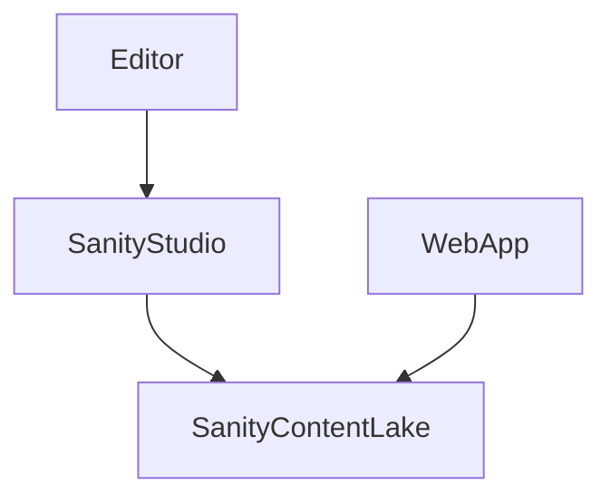

# Architecture (MVP foundations)

## Overview
This repo is a monorepo containing:
- `apps/web`: public web app (React + Vite)
- `apps/studio`: Sanity Studio (schemas + editorial UI)
- `packages/shared`: shared schema-aligned types and GROQ helpers

## Data flow
1. Editors manage content in Sanity Studio.
2. Web app queries content from the Sanity Content Lake (public dataset).
3. Web UI renders localized fields (EN/ES) with defined fallback behavior.

## State management (Zustand)
Use Zustand for:
- language preference (persisted)
- compare set (persisted)
- favorites (persisted)
- quiz in-progress (persisted)
- UI state (e.g., filter drawer open)

## Routing (web)
Initial route map (aligned to PRD IA):
- `/` Home
- `/careers` Browse Careers
- `/careers/:slug` Career Detail
- `/compare` Compare Careers
- `/quiz` Quiz flow
- `/resources` Resources hub

## Localization
- UI strings are translated through i18n utilities.
- Sanity content uses localized objects `{en, es}`.
- UI fallback rule: show English when Spanish is missing and optionally indicate missing translation.

## Accessibility baseline
- Semantic landmarks and headings (H1/H2/H3).
- Focus-visible styles and skip-to-content.
- Accessible drawers/modals (focus trap + ESC + ARIA).

